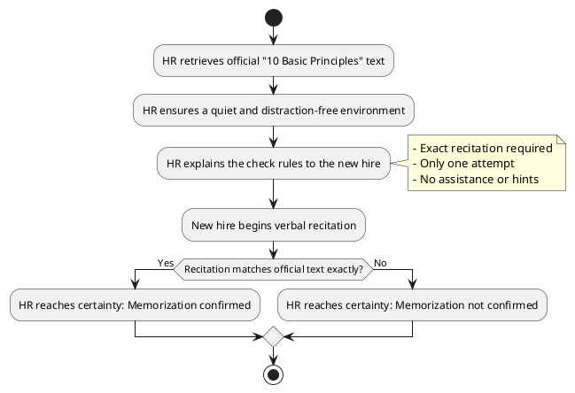

# Design Document

**Task Title:** Ensuring HR Confirms New Hires Have Memorized the 10 Basic Principles  
**Prepared By:** Tural Babayev / ABCVYZ  
**Date:** 16.04.2025  
**Version:** 1.0 (Final)

---

## 1. Objective

The objective of this design is to create a simple and clear "check step" process that enables Human Resources (HR) to transition from **"not sure"** (Situation 0) to **"sure"** (Situation 1) regarding whether a new hire has memorized the "10 Basic Principles" verbatim.

The process ensures HR can reliably and consistently reach a definitive internal certainty without any ambiguity, following the approved Scope of Work.

---

## 2. Method Overview

- **Type of Check:** Verbal (oral) recitation.
- **Evaluation Method:** Manual, internal comparison by HR against the official text.
- **Number of Attempts:** Only one attempt is allowed.
- **Assessment Criteria:** 100% word-for-word match.

---

## 3. Process Flow Diagram

> **Important Note:**  
> Informing the new hire about the result or keeping a record is outside the scope of this design.

---

## 4. Detailed Process Steps

### Step 1: Preparation

- HR retrieves the validated "10 Basic Principles" document.
- HR ensures the environment is quiet and free of distractions.
- HR reviews the evaluation criteria.

### Step 2: Instruction to New Hire

- HR explains the following rules clearly:
  - "You must recite the 10 Basic Principles exactly as written."
  - "You have only one attempt."
  - "No help, hints, or corrections will be given during your attempt."

### Step 3: Recitation

- New hire verbally recites the principles.
- HR listens silently, without providing assistance or interruption.

### Step 4: Evaluation

- HR manually compares the spoken words to the official text.
- HR internally reaches certainty:
  - **If 100% match:** Memorization is confirmed.
  - **If any deviation:** Memorization is not confirmed.

---

## 5. Checklist for HR Representatives

- [ ] Retrieved and reviewed the official "10 Basic Principles" text.
- [ ] Ensured the environment is quiet and distraction-free.
- [ ] Explained the process rules clearly to the new hire.
- [ ] Listened attentively without assisting.
- [ ] Compared the recitation word-for-word.
- [ ] Internally reached certainty (confirmed or not confirmed).

---

## 6. Handling Special Situations (Edge Cases)

| Scenario | HR Action |
|:---|:---|
| Minor hesitation but correct words | Allow and continue. |
| Request for help during recitation | Politely decline and allow to continue. |
| Forgetting or stopping | Conclude the attempt as not confirmed. |
| Minor pronunciation variations (accent) | Acceptable if wording is correct. |

---

## 7. Success Criteria

- HR can definitively determine the memorization status after one attempt.
- No ambiguity remains in the result.
- The check step is applied consistently by all HR representatives.

---

## 8. Scope Limitations

- No retries, reattempts, or coaching.
- No digital or manual recording of results.
- New hire notification is not part of this design.

---

## 9. Approval

- **Prepared By:** Tural Babayev / ABCVYZ
- **Approved By:** [Requester Approval Pending]
- **Approval Date:** [Pending]

---

*End of Design Document*
