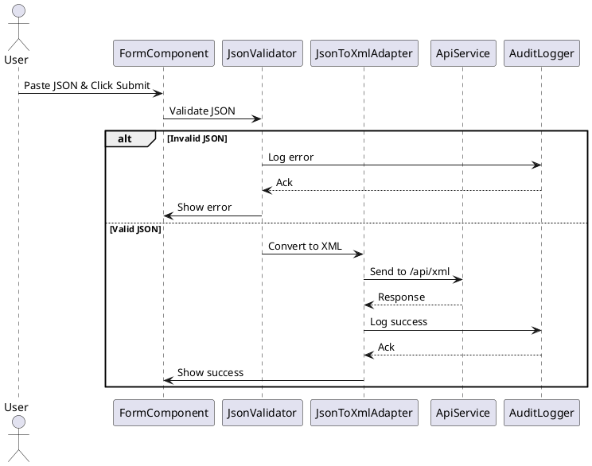
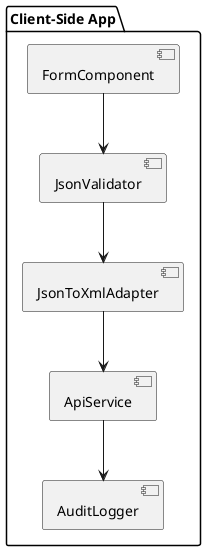

# JSON to XML Adapter Submission Web Application - Design Document

**Prepared By:** Tural BABAYEV / ABCVYZ  
**Date:** 02.05.2025  
**Version:** 1.0

---

## 1. Overview
This document defines the technical design of the JSON to XML Adapter Web Application (APP). The APP accepts structured JSON data, validates it, transforms it into an XML format, and transmits it to a third-party API. All major events (success/failure) are logged to a NoSQL database via a REST API.

---

## 2. System Architecture

- **Type:** Frontend-only SPA
- **Framework:** Vanilla JavaScript + HTML
- **CDN Libraries:**
  - [Axios](https://cdn.jsdelivr.net/npm/axios)
  - [Fast-XML-Parser](https://cdn.jsdelivr.net/npm/fast-xml-parser)
- **Third-party Integration:**
  - XML Submit API: `POST api/xml`
  - Audit Logging API: `POST http://db.com/api/v1/query/auditdb`

---

## 3. Data Design

### 3.1 Input JSON Example
```json
{
  "from_msisdn": "12345678910123",
  "to_msisdn": "32109876543210",
  "message": "Hello World!",
  "encoding": "utf-8",
  "field-map": {
    "field_1": "boolean",
    "field_2": "integer"
  },
  "field_1": true,
  "field_2": 95
}
```

### 3.2 Expected XML Output
```xml
<envelope>
  <from_msisdn>12345678910123</from_msisdn>
  <to_msisdn>32109876543210</to_msisdn>
  <message>Hello World!</message>
  <encoding>utf-8</encoding>
  <field_1 type="boolean">true</field_1>
  <field_2 type="integer">95</field_2>
</envelope>
```

---

## 4. Functional Components

| Component | Responsibility |
|-----------|----------------|
| `FormComponent` | Displays textarea for JSON input & submit button |
| `JsonValidator` | Ensures required fields exist, parses `field-map` |
| `JsonToXmlAdapter` | Converts valid JSON into required XML format |
| `ApiService` | Sends XML to external API, communicates with audit logger |
| `AuditLogger` | Sends SQL-like audit commands to NoSQL database API |

---

## 5. Interfaces

### 5.1 Submit Form
- Type: HTML form with textarea
- Trigger: Button click calls validation & conversion

### 5.2 POST /api/xml – XML Submission
- **URL:** `http://transter.to/api/xml`
- **Method:** POST
- **Body:** XML string
- **Success:** HTTP 200
- **Failure:** Show error to user and logging to

### 5.3 POST /api/v1/query/auditdb – Audit Logging
- **URL:** `http://db.com/api/v1/query/auditdb`
- **Method:** POST
- **Headers:** `Content-Type: application/json`
- **Body Format:**
```json
{
  "language": "sql",
  "command": "INSERT INTO audit SET timestamp = '2025-05-02T11:00:00Z', status = 'success', details = 'XML sent'"
}
- **Failure:** Processing must stop. User should see error message.

---

## 6. Error Handling & Validation

- Invalid JSON → show error and log via audit
- Missing required fields → show validation error and log
- Audit logging fails → stop entire operation
- XML API fails → show error and still log the attempt

---

## 7. UML Diagrams

### 7.1 Sequence Diagram (PlantUML)


### 7.2 Component Diagram



---

**End of Design Document**

