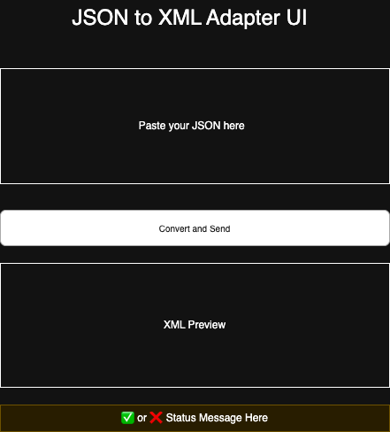
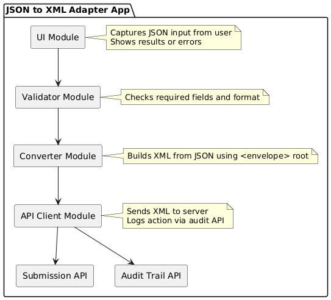

# JSON-XML Adapter Web APP Design

## 1 - Wireframe



---
## 2 - JSON Input Field Definition

### Required Fields

- `from_msisdn` (string): (e.g., "12345678910123")
- `to_msisdn` (string): (e.g., "12345678910123")
- `message` (string): Message body in ASCII or UTF-8
- `encoding` (string):(e.g., "UTF-8")

## Optional Field

- `field-map` (object): Describes additional fields in the JSON payload. Each key represents a field name, and its value defines the type. Accepted types are: `integer`, `string`, `boolean`, `float`.

### Example

```json
{
  "from_msisdn": "12345678910123",
  "to_msisdn": "12345678910123",
  "message": "Hello World",
  "encoding": "UTF-8",
  "priority": 1,
  "field-map": {
    "priority": "integer"
  }
}
```
---
## 3 - JSON → XML mapping rules

- All output is wrapped under `<envelope>`.
- Each top-level JSON key becomes an XML tag.
- If `field-map` exists, it provides a `type` attribute for the matching fields.
- `field-map` itself is not converted.

### Mapping Logic

1. Skip `field-map`.
2. For each JSON key:
   - Create `<key>value</key>`
   - If key exists in `field-map`, add attribute: `<key type="...">value</key>`

---

## 4  API Request Format Specification

The request format defines how the frontend will communicate with the backend using REST-style POST requests. Two separate endpoints are used: one for XML submission, and one for audit logging.

#### XML Submission API

- **Endpoint:** `POST api/xml`
- **Headers:**  
  `Content-Type: application/xml`
- **Example Body:**
  ```xml
  <envelope>
    <from_msisdn>12345678901</from_msisdn>
    <to_msisdn>12345678902</to_msisdn>
    <message>Hello!</message>
    <encoding>utf-8</encoding>
    <custom_field_1 type="string">extra_value</custom_field_1>
  </envelope>
   ``` 

#### Audit Trail Logging API
- **Endpoint:** `POST /query`
- **Headers:**  
`Content-Type: application/json`
- **Example Body:**
```json
{
  "language": "sql",
  "command": "INSERT INTO logs SET operation = 'submit_xml', status = 'success', timestamp = '2025-05-07T15:00:00Z'"
}
```

---

### 5 Mock API behavior:

---

### 6 - Component Diagram

> The diagram below shows the main modules




